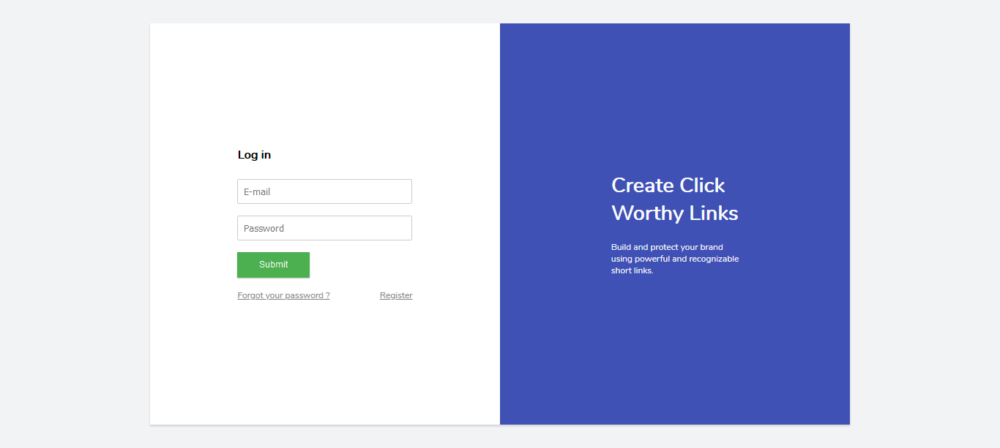
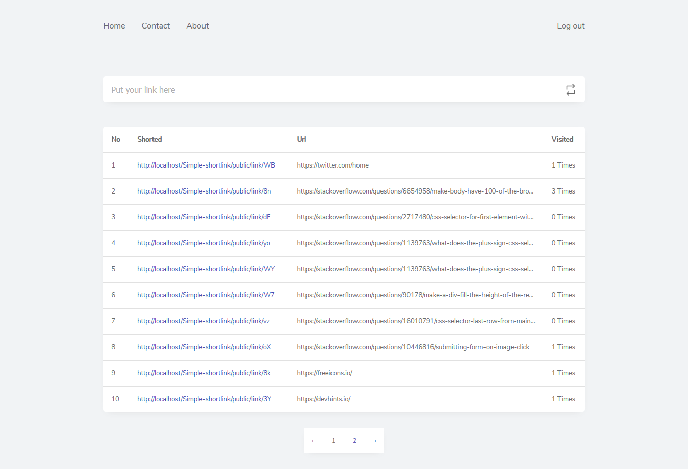

# Simple-shortlink

## Cara Install

```
Install system requirement untuk laravel antara lain:
1. PHP >= 7.2.0
2. BCMath PHP Extension
3. Ctype PHP Extension
4. Fileinfo PHP extension
5. JSON PHP Extension
6. Mbstring PHP Extension
7. OpenSSL PHP Extension
8. PDO PHP Extension
9. Tokenizer PHP Extension
10. XML PHP Extension

Selengkapnya bisa anda baca di [sini](https://laravel.com/docs/6.x#server-requirements)
```

```
Tahap penginstallan:
1. Clone repository ini ke komputer anda
2. Buka cmd jalankan perintah "composer install"
3. Rename ".env.example" menjadi ".env"
4. Setting nama databae, username, serta password di file .env
```



